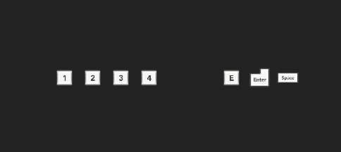

# Rewired.UI.Hotkeys

A plugin for Guavaman's Rewired Unity Asset that provides an easy-to-use API for showing controller hotkeys to the player at runtime based on their bindings and input method.

## Features
- full supports for Rewired's glyphs in UI
- binded to Rewired's actions (you don't miss any of actions)
- fast integration of keyboard, mouse and gamepads glyphs
- batch import potential sprites into controller profile
- able to switch to another controller in realtime

## How to use
- create controller profiles for each device what you need via context menu `Create->Rewired->Controller Profile`

- create `Rewired Hotkeys Manager` via top menu `Window->Rewired->Create->Hotkeys Manager (in scene)` or `Window->Rewired->Create->Hotkeys Manager (prefab)`

- add `RewiredHotkey` component into your UI and select specific action what you want to bind

## Installation
##### via Unity Package Manager
The latest version can be installed via [package manager](https://docs.unity3d.com/Manual/upm-ui-giturl.html) using following git URL: \
`https://github.com/am1goo/Rewired.UI.Hotkeys.git#1.0.0`

## Requirements
- Unity Engine 2019.x
- [Rewired Advanced Input System](https://assetstore.unity.com/packages/tools/utilities/rewired-21676)

## Tested in
- Unity 2019.4.x
- Unity 2020.3.x
with
- Rewired Advanced Input System 1.1.39.2 (U2019)
- Rewired Advanced Input System 1.1.51.1 (U2022)
  
## Using in
[Sin Slayers](https://www.gog.com/en/game/sin_slayers) - RPG with roguelike elements set in a dark fantasy world, where your choices determine how challenging the fights and enemies will be.

## Contribute
Contribution in any form is very welcome. Bugs, feature requests or feedback can be reported in form of Issues.
